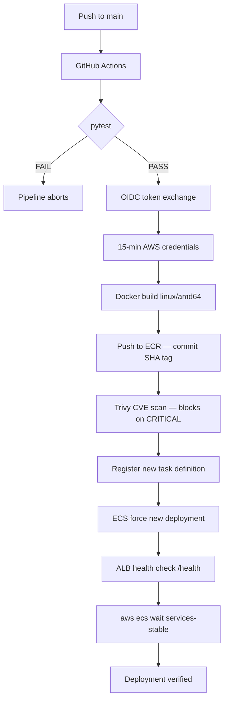

# CI/CD Pipeline — AWS ECS Fargate with OIDC Keyless Auth & Distributed Rate Limiter

> A production-grade deployment pipeline shipping a containerized Flask REST API to
> AWS ECS Fargate on every push to main. No AWS credentials stored anywhere.
> Rate limiting enforced across all replicas via ElastiCache Redis. PostgreSQL on RDS,
> multi-AZ task placement, TLS termination at the ALB, and full CloudWatch observability.

## Architecture



## Key Engineering Decisions

| Decision | Why |
|---|---|
| OIDC over static IAM keys | 15-min scoped tokens, `sub` claim locks to this repo+branch |
| pytest before AWS auth | Fail fast — a bad test costs 30s not a failed ECS rollout |
| Commit SHA image tag | Full traceability from running task back to source commit |
| Trivy blocks on CRITICAL only, `ignore-unfixed: true` | Unfixed CVEs would make the pipeline permanently red for no actionable reason |
| Sliding window log rate limiter | No boundary problem; Redis sorted sets are the right primitive |
| Lua EVAL for atomicity | Eliminates TOCTOU race with N replicas — verified under real 2-task, 2-AZ load (see Rate Limiter Verification) |
| Fail-open on Redis down | Redis outage → API degradation, not API outage |
| RDS PostgreSQL over SQLite | Stateless, horizontally scalable tasks; survives redeployment |
| ECS health check grace period: 90s | Default of 0s caused new tasks to be killed before they could pass ALB health checks — see Incidents below |

## Infrastructure Summary

| Component | Value |
|---|---|
| ECS Cluster | `Flask_application` |
| ECS Service | `flask-api-service-0o12uaja` |
| Task definition family | `flask-api` |
| ALB | `fld` — `fld-1952811936.us-east-2.elb.amazonaws.com` |
| Target group | `flask-api-tg` |
| RDS instance | `database-1` (PostgreSQL 15, db.t3.micro) |
| Redis | ElastiCache cluster `flask-redis-cluster` |
| VPC | Default VPC, 3 AZs |
| Region | us-east-2 |
| Desired task count | 2 (spread across `us-east-2a` / `us-east-2c`) |

## Security Groups

| Name | Purpose | Inbound source |
|---|---|---|
| `flask-api-alb-sg` | ALB | Public internet, 80/443 |
| `flask-api-ecs-sg` | ECS tasks | ALB SG, port 8080 |
| `flask-rds-sg` | RDS PostgreSQL | ECS SG, port 5432 |
| `flask-api-redis-sg` | ElastiCache | ECS SG, port 6379 |

## Secrets (AWS Secrets Manager)

No plaintext credentials in the task definition. Task execution role (`ecsTaskExecutionRole`) has a scoped inline policy allowing `secretsmanager:GetSecretValue` only on `flask-api/*`.

| Secret name | Injected as |
|---|---|
| `flask-api/jwt-secret-key` | `JWT_SECRET_KEY` |
| `flask-api/cart-encryption-key` | `CART_ENCRYPTION_KEY` |
| `flask-api/db-url` | `DATABASE_URL` (includes `?sslmode=require` — RDS enforces SSL by default) |

## Performance

| Metric | Value |
|---|---|
| P50 latency (`/health`) | 42ms |
| P99 latency (`/health`) | 86ms |
| Load test | Locust, 10 concurrent users, 90s sustained |
| Requests tested | 416, 0 failures |
| Rate limit threshold | 10 req / 60s per IP |
| Rate limiter overhead | Redis EVAL, atomic Lua script |
| ECS task replacement time | ~60 seconds |

## Rate Limiter Verification (Multi-AZ)

With 2 tasks running simultaneously in separate AZs (`us-east-2a`, `us-east-2c`), 12 rapid requests to `/register` were sent through the ALB (which round-robins across both tasks):

```
201 x10
429 x2
```

The limit held at exactly 10 total across both replicas — not 20 (10 per task). This confirms the Redis-backed Lua script correctly serializes the check-and-increment across independently running containers, closing the TOCTOU race a naive per-task or `INCR`-only implementation would have.

## Known Constraints

- **Rate limiter fails open** if Redis is unreachable — an explicit trade-off (availability over strict enforcement during a cache outage).
- **`db.create_all()` is not a migration strategy** — it creates missing tables on startup but does not apply schema changes to existing tables. A future iteration would use Alembic/Flask-Migrate.
- **RDS is single-instance, not Multi-AZ (RDS-level)** — this project uses ECS-level multi-AZ task placement; the database itself is still a single AZ. A further hardening step would be RDS Multi-AZ deployment.

## Incidents & Debugging (real issues hit and resolved during this build)

These are documented because they were genuine production-style debugging exercises, not scripted steps — each is a legitimate interview talking point.

1. **ECS health check grace period defaulted to 0 seconds.** New tasks were being killed by ECS before they had time to pass ALB health checks, causing every deployment to rely on a lucky retry. Diagnosed via `describe-services` deployment events + `stoppedReason` on the failed task (`Task failed ELB health checks`, exit code `0` — not a crash). Fixed by setting `healthCheckGracePeriodSeconds: 90`.

2. **CloudWatch dashboard was built against the wrong ALB.** The account had two load balancers (`flask-api-alb`, unused/stale, and `fld`, the one actually receiving traffic). The dashboard and alarm were initially wired to metrics for the ALB not receiving traffic, producing blank graphs. Diagnosed by comparing the DNS name being curled against `aws elbv2 describe-load-balancers` output; resolved by rebuilding the dashboard/alarm against the correct ALB's ARN.

3. **RDS instance was created in the wrong VPC.** `flask-api-rds-sg` and the RDS instance ended up in a different VPC than the ECS tasks, causing `InvalidGroup.NotFound: two resources that belong to different networks` when attempting to authorize a security-group-referenced ingress rule. Diagnosed by comparing `VpcId` across both security groups directly; resolved by deleting and recreating the RDS instance with the VPC explicitly verified before creation.

4. **RDS master username mismatch.** The app was configured to connect as `flask_admin`, but the instance's actual master username was `postgres` (set during a console step that wasn't consistently tracked). This produced a `password authentication failed` error that looked identical to a wrong-password error and initially led to (correctly ruled out) hypotheses about password URL-encoding and SSL requirements before the username itself was confirmed via `describe-db-instances --query 'MasterUsername'`.

5. **RDS enforces `sslmode=require` by default** on newer PostgreSQL versions — a plaintext connection attempt returns a `pg_hba.conf` rejection. Connection string requires `?sslmode=require` appended.

## Setup

1. Clone the repo and install dependencies: `pip install -r requirements.txt`
2. For local dev, no `DATABASE_URL` is needed — falls back to `sqlite:///data.db`
3. Run locally: `flask run` or `gunicorn app:app`
4. Push to `main` — GitHub Actions handles test, build, scan, and deploy to ECS Fargate automatically, with deployment verification before reporting success

## Screenshots

<!-- Add these once captured -->

- [ ] Green GitHub Actions run (Trivy clean scan confirmed)
- [ ] ECS task RUNNING status, 2 tasks across 2 AZs
- [ ] ALB health check returning 200
- [ ] 429 response after rate limit exceeded (multi-AZ test)
- [ ] CloudWatch dashboard with live traffic data
- [ ] RDS instance `available`, connected

---

**The constraints and incidents sections are not weakness — they are maturity.** Acknowledging what broke, how it was diagnosed, and how it was fixed reads as professional engineering judgment. Hiding it reads as not knowing it happened.
